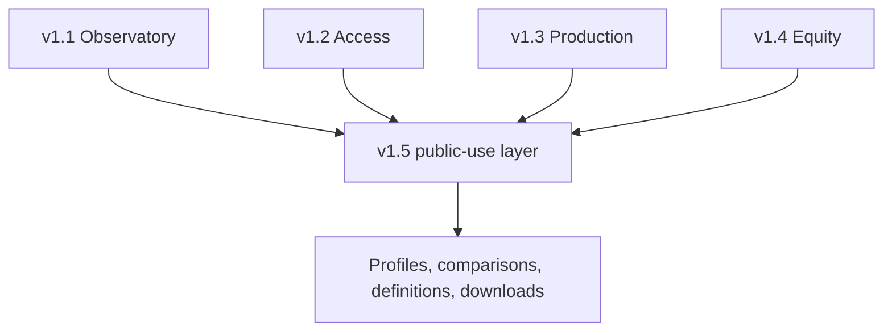

# The Bay Outlook

**Economic Research · Policy Analysis · Regional Futures**

> An evidence-first economic and housing-intelligence project for understanding change across the nine-county San Francisco Bay Area.

## Version 1.5 review candidate

Version 1.5 adds an analytical and public-use layer across the four verified Phase 14 housing releases. It preserves each release as a separate, namespaced module and provides county profiles, same-period comparisons, definitions, sources, and downloadable data without producing rankings, scores, causal claims, or automated narrative analysis.

| Scope | Verified result |
|---|---:|
| Bay Area counties | 9 |
| Inherited verified modules | 4 |
| Namespaced measures | 139 |
| Normalized observations | 10,224 |
| Source-registry records | 22 |
| Inherited evidence snapshots | 181 |
| County profile measures | 15 |
| Same-period comparison measures | 12 |
| Version 1.5 build checks | 16/16 passed |
| Public repository tests | 65/65 passed, 2 expected private-artifact skips |
| Full private project suite | 136/136 passed |

This branch is a publication candidate. The GitHub merge and public Site deployment remain pending explicit named-human approval. The Phase 10 baseline report remains on `human_approval_hold`.

## What Version 1.5 adds

- one long-format public-use observation table with module, county, period, subgroup, source, derivation, formula, universe, and uncertainty fields;
- a 139-row namespaced measure catalog and a 22-row source registry;
- 15 fixed county-profile measures selected at their latest common nine-county period;
- 12 same-period comparison measures displayed in alphabetical county order;
- complete CSV and JSON downloads plus a review-only SQLite build artifact;
- explicit separation of ACS residence estimates from LODES workplace-job records; and
- a read-only candidate workflow that cannot merge, deploy, rank counties, score policy, or publish narrative analysis.



## Reproduce and verify

The public builder reads the four inherited, versioned payloads already present in the repository. It performs no live-source retrieval and does not change inherited values.

```bash
python -m pip install -e .
PYTHONPATH=src python -m bay_outlook.cli build-phase14-public-use
PYTHONPATH=src python -m bay_outlook.cli verify-phase14-public-use
PYTHONPATH=src python -m unittest discover -s tests -v
```

The workflow has read-only repository permission. It uploads a candidate review artifact and never commits, merges, deploys, or publishes analysis.

## What this public bundle contains

The publication-safe bundle contains the integration adapter, configuration, methods, limitations, tests, complete normalized observations, county profile and comparison exports, measure and source registries, public JSON payloads, quality checks, and a file-hash manifest. It intentionally excludes raw source files, private checkpoint databases, internal editorial records, Site source, and the unapproved baseline-report artifact.

## Evidence boundaries

- “Latest” differs by source and measure; every displayed value retains its observation period.
- County comparisons are descriptive and remain alphabetically ordered.
- ACS five-year estimates overlap across vintages and retain available 90% margins of error.
- LODES describes jobs and workplace flows, not unique people or household residence.
- Redfin is a Tier 2 private primary-market source, not a government statistic.
- HUD Fair Market Rent is a program benchmark, not a county median asking rent.
- Court filing records are not unique displaced households or final case outcomes.
- Annual applications, permits, entitlements, and completions are separate stage flows, not one project cohort.
- RHNA progress uses a full-cycle allocation denominator and a partial-cycle numerator.
- Zoning composition is not legal capacity, feasibility, policy performance, or a unit estimate.
- Race and Hispanic-origin table iterations overlap and are not additive.

[Methodology](docs/housing-public-use/METHODOLOGY.md) · [Data dictionary](docs/housing-public-use/DATA_DICTIONARY.md) · [Limitations](docs/housing-public-use/LIMITATIONS.md) · [Review runbook](docs/housing-public-use/RUNBOOK.md) · [Project case study](case-study.pdf)

## Role and development approach

Created and directed by Ryan Briggs as an independent economics and policy research project. Development was AI-assisted; Ryan defined the scope, research framework, evidence rules, acceptance gates, and editorial boundaries, then reviewed and verified the implementation and claims.

## License

No open-source license has been selected. All rights are reserved unless a license is added later.
