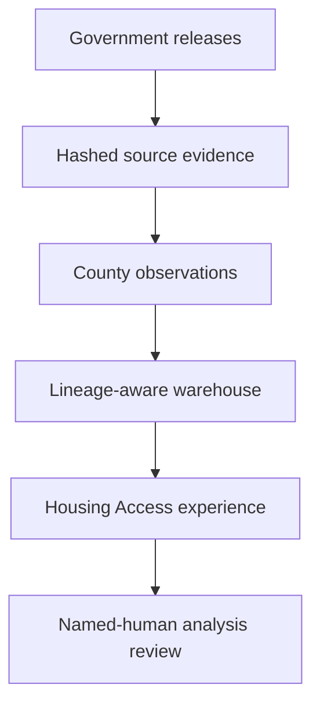

# The Bay Outlook

**Economic Research · Policy Analysis · Regional Futures**

> An evidence-first economic and housing-intelligence project for understanding change across the nine-county San Francisco Bay Area.

[**Open Version 1.2: Housing Access & Displacement →**](https://the-bay-outlook.kw5f4w8d9g.chatgpt.site/housing/access)


## Version 1.2 verified scale

| Scope | Audited result |
|---|---:|
| Bay Area counties | 9 |
| Access-focused domains | 6 |
| Measures in the access layer | 38 |
| Access observations | 1,116 |
| Government source systems | 8 |
| Immutable source snapshots in the sealed checkpoint | 49 |
| Build quality checks | 9/9 passed |
| Private completion and publication gates | 19/19 passed |

Version 1.2 extends—not replaces—the verified Version 1.1 Housing Observatory,
which contains 3,753 observations across seven core housing domains.

## What Version 1.2 adds

- limited civil unlawful-detainer filings and dispositions;
- transparent displacement-pressure components, kept separate rather than scored;
- HUD PIT homelessness estimates and HIC bed inventories;
- income-targeted housing permits and sixth-cycle RHNA progress;
- HUD-assisted housing characteristics; and
- worker earnings compared with HUD fair-market-rent benchmarks.

PIT count design is attached to every county-year. The interface warns before
showing change when a cycle is sheltered-only. The release does not produce a
composite displacement score, rank counties, infer causation, or automate public
narrative analysis.



## Reproduce the build

The public adapter preserves complete court and HUD workbooks, selected ACS
county rows with upstream file digests, and an observation-to-source join for
multi-source calculations.

```bash
python -m pip install -e .
PYTHONPATH=src python -m bay_outlook.cli build-phase14
PYTHONPATH=src python -m bay_outlook.cli build-phase14-access
PYTHONPATH=src python -m bay_outlook.cli verify-phase14-access
PYTHONPATH=src python -m unittest discover -s tests -v
```

The scheduled workflow has read-only repository permission. It creates a review
candidate and does not commit, deploy, or publish narrative analysis.

## What this public bundle contains

This publication-safe portfolio bundle contains the live-source adapter,
configuration, source and indicator registries, methodology, limitations, unit
and artifact checks, and selected verified county snapshots. It intentionally
excludes raw source files, private checkpoint databases, internal editorial
records, and the unapproved baseline-report artifact. The source adapter can
regenerate the evidence package from documented upstream releases.

## Evidence boundaries

- Court cases are filings and dispositions, not executed evictions.
- ACS releases are overlapping five-year estimates, not independent annual samples.
- PIT is a one-night estimate; some cycles are sheltered-only.
- HIC measures bed inventory, not occupancy, service quality, or unmet need.
- A permit is an authorization, not proof of completion or occupancy.
- RHNA is a planning allocation, and the current numerator covers 2023–2025.
- HUD FMR is an area standard, not a county asking-rent median.
- Worker earnings describe people age 16+ with earnings, not a specific household.

The baseline economic analysis remains on `human_approval_hold`. New public
narrative analysis also requires named-human editorial approval.

[Housing Access & Displacement](https://the-bay-outlook.kw5f4w8d9g.chatgpt.site/housing/access) · [Housing Observatory](https://the-bay-outlook.kw5f4w8d9g.chatgpt.site/housing) · [Methodology](docs/housing-access/METHODOLOGY.md) · [Data dictionary](docs/housing-access/DATA_DICTIONARY.md) · [Project case study](case-study.pdf)

## Role and development approach

Created and directed by Ryan Briggs as an independent economics and policy
research project. Development was AI-assisted; Ryan defined the scope, research
framework, evidence rules, acceptance gates, and editorial boundaries, then
reviewed and verified the implementation and claims.

## License

No open-source license has been selected. All rights are reserved unless a
license is added later.
