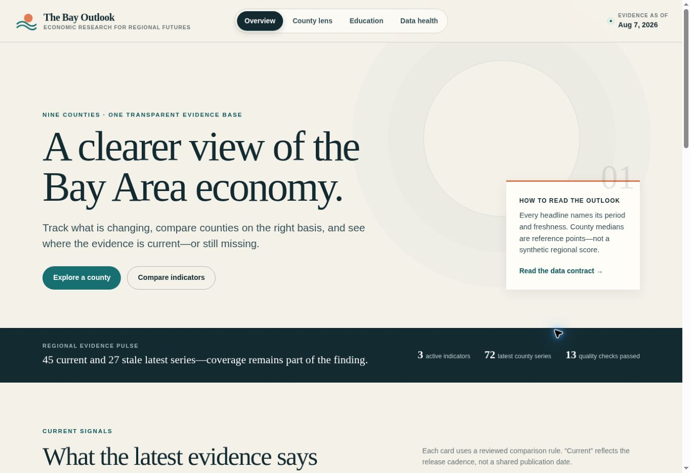
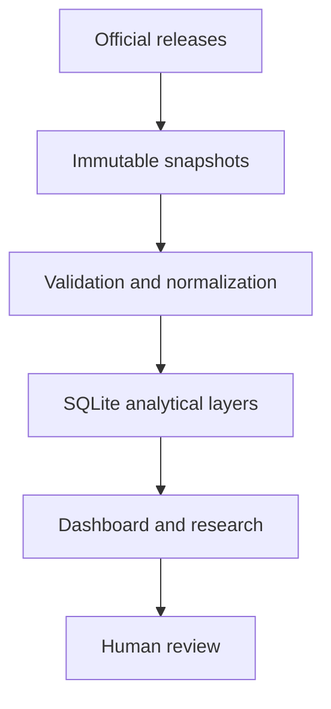

# The Bay Outlook

**Economic Research · Policy Analysis · Regional Futures**

> An evidence-first economic-intelligence project for understanding change across the nine-county San Francisco Bay Area.



## Verified project scale

| Scope | Audited result |
|---|---:|
| Bay Area counties | 9 |
| Cataloged indicators | 25 |
| Validated BLS and BEA observations | 891 |
| Active official datasets | 3 |
| Immutable raw snapshots in the private checkpoint | 14 |
| Automated tests in the audited Phase 12 repository | 92 |
| Selected tests in this publication-safe bundle | 38/38 passed |

## The problem

Bay Area economic data is fragmented across agencies, geographies, release schedules, and revision practices. A county comparison is not trustworthy unless it preserves what was measured, where it was measured, when it was released, and what evidence is missing.

## What I built

- Python ingestion and normalization adapters for federal and California sources.
- SQLite staging, dimensional, and analytical layers.
- Exact-period trends, county benchmarks, descriptive ranks, freshness, and evidence-gap handling.
- An interactive public-facing dashboard with source vintage and geography context.
- Responsible update controls that flag seven classes of material change for named-human review.
- Editorial standards that separate observation, comparison, interpretation, causation, and forecasts.



## What this public bundle contains

This is a publication-safe portfolio bundle: the interactive dashboard, case study, architecture and methodology, selected source modules, test fixtures, and core tests. It intentionally excludes the unapproved baseline-report content, internal editorial databases, knowledge-layer records, raw live snapshots, and private checkpoint databases.

Run the selected source tests with:

```bash
PYTHONPATH=src python -m unittest discover -s tests -v
```

## Evidence boundaries

The 25 indicators are a research catalog, not 25 populated live series. The 891 validated observations in this release come from BLS LAUS, BLS QCEW, and BEA CAGDP1. Housing, education, and population coverage remains incomplete and is shown as missing—not zero.

The ten-page baseline analysis is technically complete but remains on human-approval hold. It is not included or represented as published.

[Project case study](case-study.pdf) · [Architecture](docs/architecture.md) · [Methodology](docs/methodology.md) · [Interactive dashboard file](dashboard/index.html)

## Role and development approach

Created and directed by Ryan Briggs as an independent economics and policy research project. Development was AI-assisted; Ryan defined the scope, research framework, evidence rules, acceptance gates, and editorial boundaries, then reviewed and verified the implementation and claims.

## License

No open-source license has been selected. All rights are reserved unless a license is added later.
