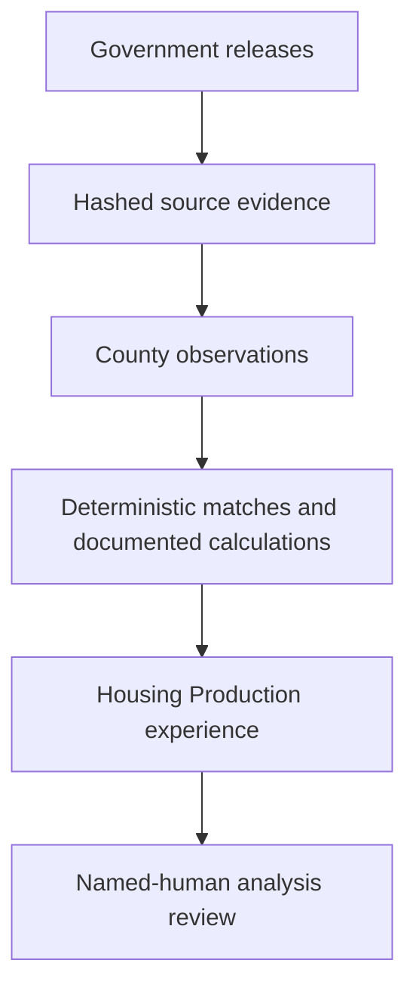

# The Bay Outlook

**Economic Research · Policy Analysis · Regional Futures**

> An evidence-first economic and housing-intelligence project for understanding change across the nine-county San Francisco Bay Area.

[**Open Version 1.3: Housing Production & Policy →**](https://the-bay-outlook.kw5f4w8d9g.chatgpt.site/housing/production)


## Version 1.3 verified scale

| Scope | Audited result |
|---|---:|
| Bay Area counties | 9 |
| Production and policy domains | 7 |
| Measures in the Version 1.3 layer | 42 |
| Production and policy observations | 1,575 |
| Government source systems | 6 |
| Immutable evidence snapshots in the sealed checkpoint | 21 |
| Deterministic timeline matches | 28,814 |
| Housing-element records | 109 |
| Build quality checks | 10/10 passed |
| Full private project suite | 120/120 passed |
| Private completion and publication gates | 21/21 passed |

Version 1.3 extends—not replaces—the verified Version 1.2 Housing Access & Displacement layer and Version 1.1 Housing Observatory.

## What Version 1.3 adds

- annual 2018–2025 housing applications, decisions, entitlements, permits, completions, and accessory dwelling units;
- exact-key application-to-stage timeline medians with eligible, matched, and interval sample counts;
- sixth-cycle RHNA allocations compared separately with reported permits and completions;
- current sixth-cycle housing-element compliance records and county summaries;
- mapped zoning composition with an explicit no-capacity-estimate boundary; and
- conditionally reported HCD rezoning acreage, capacity, and site records.

Annual application, entitlement, permit, and completion counts remain separate stage flows. They are not presented as one project cohort or conversion funnel. The release does not rank counties, score policy, infer causal effects, or automate narrative analysis.



## Reproduce and verify

The public adapter preserves complete official responses or county/year slices with upstream file digests. Multi-source observations retain an explicit observation-to-release mapping.

```bash
python -m pip install -e .
PYTHONPATH=src python -m bay_outlook.cli build-phase14
PYTHONPATH=src python -m bay_outlook.cli build-phase14-access
PYTHONPATH=src python -m bay_outlook.cli build-phase14-production
PYTHONPATH=src python -m bay_outlook.cli verify-phase14-production
PYTHONPATH=src python -m unittest discover -s tests -v
```

To verify the publication-safe bundle without retrieving sources, use:

```bash
PYTHONPATH=src python -m bay_outlook.cli build-phase14-production --offline
PYTHONPATH=src python -m bay_outlook.cli verify-phase14-production
```

The scheduled workflow has read-only repository permission. It creates a review candidate and does not commit, deploy, or publish narrative analysis.

## What this public bundle contains

The publication-safe portfolio bundle contains the live-source adapter, configuration, source and indicator registries, methods, limitations, tests, the complete 1,575-row normalized series, selected review exports, the exact public JSON payload, and a 21-snapshot evidence register. It intentionally excludes raw source files, private checkpoint databases, internal editorial records, Site source, and the unapproved baseline-report artifact.

## Evidence boundaries

- HCD APR records are jurisdiction-reported and can be revised.
- Annual stage flows are not one tracked cohort; same-year completion-to-permit ratios can exceed 100 percent.
- Timeline medians describe exact jurisdiction-plus-tracking-ID or jurisdiction-plus-APN matches, not every application.
- Housing-element compliance is an administrative status, not proof of implementation or production.
- RHNA progress uses a full-cycle denominator and a partial-cycle 2023–2025 numerator.
- Mapped zoning composition is not legal development capacity, allowed density, feasibility, or unit potential.
- Conditionally reported Table C rows are not imputed to zero.

The baseline economic analysis remains on `human_approval_hold`. New public narrative analysis also requires named-human editorial approval.

[Housing Production & Policy](https://the-bay-outlook.kw5f4w8d9g.chatgpt.site/housing/production) · [Housing Access & Displacement](https://the-bay-outlook.kw5f4w8d9g.chatgpt.site/housing/access) · [Housing Observatory](https://the-bay-outlook.kw5f4w8d9g.chatgpt.site/housing) · [Methodology](docs/housing-production/METHODOLOGY.md) · [Data dictionary](docs/housing-production/DATA_DICTIONARY.md) · [Project case study](case-study.pdf)

## Role and development approach

Created and directed by Ryan Briggs as an independent economics and policy research project. Development was AI-assisted; Ryan defined the scope, research framework, evidence rules, acceptance gates, and editorial boundaries, then reviewed and verified the implementation and claims.

## License

No open-source license has been selected. All rights are reserved unless a license is added later.
