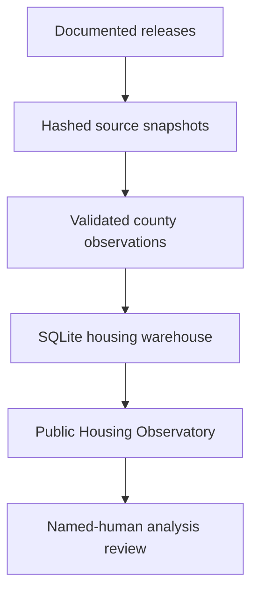

# The Bay Outlook

**Economic Research · Policy Analysis · Regional Futures**

> An evidence-first economic and housing-intelligence project for understanding change across the nine-county San Francisco Bay Area.

[**Open the Version 1.1 Housing Observatory →**](https://the-bay-outlook.kw5f4w8d9g.chatgpt.site/housing)


## Version 1.1 verified scale

| Scope | Audited result |
|---|---:|
| Bay Area counties | 9 |
| Housing domains | 7 |
| Housing metrics | 29 |
| Housing observations | 3,753 |
| Documented source systems | 5 |
| Immutable source snapshots in the private checkpoint | 35 |
| Full checkpoint tests | 108/108 passed |
| Selected public-bundle tests | 45/45 passed |
| Independent Phase 14 publication gates | 16/16 passed |

## The problem

Bay Area evidence is fragmented across agencies, geographies, release schedules,
and revision practices. A county comparison is not trustworthy unless it
preserves what was measured, where it was measured, when it was released, and
what evidence or context is missing.

## What Version 1.1 adds

The Housing Observatory covers:

- rental trends;
- home sales;
- housing permits;
- affordability ratios;
- vacancy;
- renter and owner cost burden; and
- progress toward housing-production targets.

The live interface keeps government evidence separate from Redfin's documented
private primary-market data, retains source periods beside each value, and
exposes limitations before interpretation.



## Reproduce the housing build

The source adapter streams and hashes the complete ACS and Redfin upstream files
before preserving exact nine-county source slices. Census Building Permits Survey
and California HCD responses are preserved with retrieval metadata and SHA-256
digests.

```bash
python -m pip install -e .
PYTHONPATH=src python -m bay_outlook.cli build-phase14
PYTHONPATH=src python -m bay_outlook.cli verify-phase14
PYTHONPATH=src python -m unittest discover -s tests -v
```

The scheduled workflow creates a review candidate with read-only repository
permission. It cannot commit, deploy, or publish narrative analysis.

## What this public bundle contains

This is a publication-safe portfolio bundle. It includes the live-source housing
adapter, unit and artifact checks, configuration, source and indicator
registries, methodology and limitations, the latest verified county snapshot,
RHNA progress, and selected pre-existing economic pipeline modules.

It intentionally excludes raw live snapshots, private checkpoint databases,
internal editorial records, and the unapproved baseline-report artifact. Those
exclusions do not weaken the live build: the documented source adapter can
regenerate the evidence package from the upstream releases.

## Evidence boundaries

- ACS releases are overlapping five-year estimates, not independent annual
  samples.
- Redfin is a private primary-market source and may revise its history; it is not
  presented as a government statistic.
- A permit authorizes construction but does not establish completion or
  occupancy.
- RHNA progress is a descriptive ratio of reported 2023–2025 permits to
  sixth-cycle allocations, not a forecast.
- Affordability ratios are ratios of county medians and do not describe a
  particular household.

The ten-page baseline economic analysis remains on `human_approval_hold`. New
public narrative analysis also requires named-human editorial approval.

[Live Housing Observatory](https://the-bay-outlook.kw5f4w8d9g.chatgpt.site/housing) · [Regional outlook](https://the-bay-outlook.kw5f4w8d9g.chatgpt.site) · [Housing methodology](docs/housing-observatory/METHODOLOGY.md) · [Housing data dictionary](docs/housing-observatory/DATA_DICTIONARY.md) · [Project case study](case-study.pdf)

## Role and development approach

Created and directed by Ryan Briggs as an independent economics and policy
research project. Development was AI-assisted; Ryan defined the scope, research
framework, evidence rules, acceptance gates, and editorial boundaries, then
reviewed and verified the implementation and claims.

## License

No open-source license has been selected. All rights are reserved unless a
license is added later.
