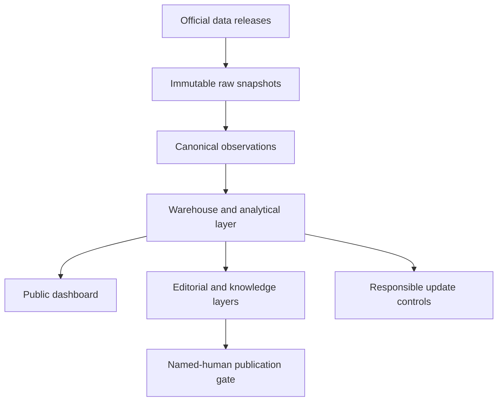
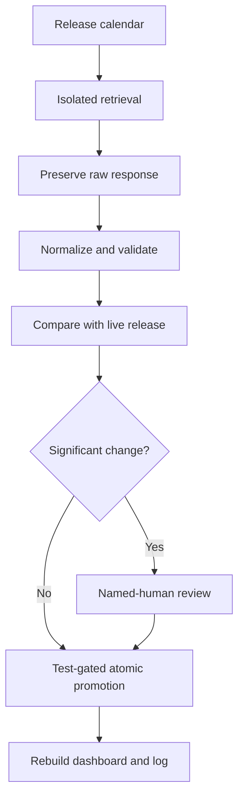

# Architecture and Data Pipeline

## System architecture

Every downstream product retains a path to the original release, retrieval time, release vintage, and raw-file hash. Geography remains explicit so residence-based labor statistics, establishment-based employment, production-location GDP, household measures, and school outcomes are not silently merged.

## Responsible update pipeline

Automation may retrieve, validate, compare, test, and promote low-risk data. It has no authority to write economic conclusions, approve research, or publish the baseline report.

## Public presentation layer

The production site is a small Vinext/React presentation shell around the dependency-free Phase 8 dashboard. The dashboard remains a self-contained HTML artifact, while the presentation layer adds:

- the regional evidence pulse;
- two source-data charts;
- an embedded and full-screen dashboard entry point;
- a visible coverage table;
- a four-stage methodology explanation;
- a truthful report approval status; and
- web and PDF case studies.
